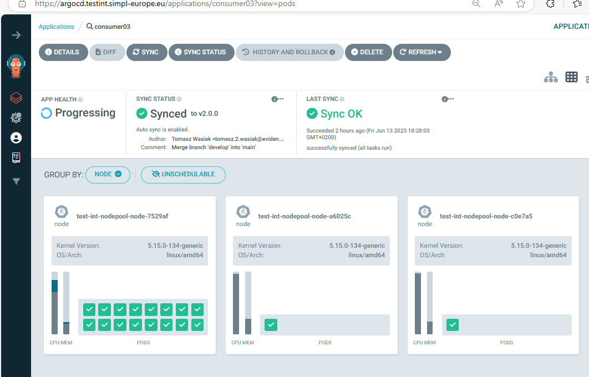

# Consumer Agent

<!-- TOC -->
* [Consumer Agent](#consumer-agent)
  * [Description](#description)
  * [Pre-Requisites](#pre-requisites)
    * [Tools](#tools)
    * [DNS entries](#dns-entries)    
  * [Deployment](#deployment)
    * [Preliminary tasks](#preliminary-tasks)
      * [Vault related tasks](#vault-related-tasks)
        * [Secret for EDC](#secret-for-edc)
    * [Deployment using ArgoCD](#deployment-using-argocd)
    * [Manual deployment](#manual-deployment)
        * [Files preparation](#files-preparation)
        * [Deployment](#deployment-1)
    * [Verification of deployment](#verification-of-deployment)
  * [Additional steps](#additional-steps)
    * [Onboarding](#onboarding)
    * [Monitoring](#monitoring)
* [Troubleshooting](#troubleshooting)
<!-- TOC -->

## Description

This repo contains:
- a master helm chart allowing to deploy a **Consumer** agent using a single command.
- templates of values.yaml files used inside *Integration* environment under `app-values` folder

## Pre-Requisites

### Tools
| Pre-Requisites      |     Version     | Description                                                                                                                                                                               |
|---------------------|:---------------:|-------------------------------------------------------------------------------------------------------------------------------------------------------------------------------------------|
| DNS sub-domain name |       N/A       | This domain will be used to address all services of the agent. <br/> example: `*.consumer03.testint.simpl-europe.eu` | 
| external-dns    | bitnami/external-dns:0.16.1 | Currently version docker.io/bitnami/external-dns:0.16.1-debian-12-r should be used as externaldns. Unfortunately, using a newer version caused DNS to work incorrectly. |  
| Kubernetes Cluster  | 1.29.x or newer | Other version *might* work but tests were performed using 1.29.x version                                                                                                                  |
| nginx-ingress       | 1.10.x or newer | Used as ingress controller. <br/> Other version *might* work but tests were performed using 1.10.x version. <br/> Image used: `registry.k8s.io/ingress-nginx/controller:v1.10.0`          |
| cert-manager        | 1.15.x or newer | Used for automatic cert management. <br/> Other version *might* work but tests were performed using 1.15.x version. <br/> Image used: `quay.io/jetstack/cert-manager-controller:v1.15.3` |                                                                   |
| argocd              | 2.11.x or newer | Used as GitOps tool . App of apps concept. <br/> Other version *might* work but tests were performed using 2.11.x version. <br/> Image used: `quay.io/argoproj/argocd:v2.11.3`            |

### DNS entries 

| Entry Name | Entries |
| ------------- | --------------------------------------------------------------------------------------------------- |
| catalogue-ui | catalogue-ui.(namespace).int.simpl-europe.eu 
| contract-consumption-be| contract-consumption-be.(namespace).int.simpl-europe.eu
| edc-connector-adapter | edc-connector-adapter.(namespace).int.simpl-europe.eu
| simpl-edc-ingress | edc.(namespace).int.simpl-europe.eu/management<br>edc.(namespace).int.simpl-europe.eu/api<br>edc.(namespace).int.simpl-europe.eu/protocol<br>edc.(namespace).int.simpl-europe.eu/public<br>  edc.(namespace).int.simpl-europe.eu/control  
| simpl-fe-ingress | participant.fe.(namespace).int.simpl-europe.eu/users-roles <br>participant.fe.(namespace).int.simpl-europe.eu/participant-utility 
| simpl-ingress | participant.be.(namespace).int.simpl-europe.eu 
| xfsc-advsearch-be | xfsc-advsearch-be.(namespace).int.simpl-europe.eu 

## Deployment

### Preliminary tasks

#### Vault related tasks

You can access vault on https://vault.**commonnamespacetag**.**domainsuffix**
Root token can be found in common namespace, secret vault-unseal-keys, in key vault-root. 

The description of using vault is in a separate document:

https://code.europa.eu/simpl/simpl-open/development/agents/common_components/-/blob/feature/documentation_verification/documents/Using_Vault.md

Before you proceed with the next steps related to accessing your Vault and changing its contents, please read the document above.<BR>
<BR>


##### Secret for EDC

Create a key for Signer named "*consumer03*-simpl-edc" replacing "03" in "consumer03" with the appropriate entry and the data mentioned in the table with proper values. 

```
{
  "contractmanager_apikey": "apikey",
  "edc_datasource_default_password": "edc",
  "edc_datasource_policy_password": "edc",
  "edc_ionos_access_key": "accesskeystring",
  "edc_ionos_endpoint": "s3-eu-central-1.ionoscloud.com",
  "edc_ionos_endpoint_region": "de",
  "edc_ionos_secret_key": "secretkeystring",
  "edc_ionos_token": "tokenstring",
  "otel_experimental_log_level": "debug",
  "otel_exporter_otlp_endpoint": "http://collector.commonns.domainsuffix",
  "otel_exporter_otlp_protocol": "http/protobuf",
  "otel_instrumentation_http_url_connection_enabled": "false",
  "otel_instrumentation_jdbc_enabled": "false",
  "otel_instrumentation_jersey_enabled": "false",
  "otel_instrumentation_servlet_enabled": "false",
  "otel_logs_exporter": "none",
  "otel_metrics_exporter": "none",
  "otel_resource_attributes": "service.name=edc,deployment.environment=namespace",
  "otel_traces_exporter": "otlp"
}
```

| Variable name                    |     Example         | Description              |
| ----------------------           |     :-----:         | ---------------          |
| contractmanager_apikey           | apikey              | api key string           |
| edc_datasource_default_password  | dbpassstring        | take the password from *consumer03*-postgres-passwords vault secret, key *consumer03*-edc |
| edc_datasource_policy_password   | dbpassstring        | take the password from *consumer03*-postgres-passwords vault secret, key *consumer03*-edc |
| edc_ionos_access_key             | accesskeystring     | Access key for S3 - please contact IONOS to get the correct value. Currently the best way is to send an email requesting this data to Paulo Cabrita: paulo.cabrita@ionos.com |
| edc_ionos_endpoint               | s3-eu-central-1.ionoscloud.com | S3 server url |
| edc_ionos_endpoint_region        | de                  | Two letter country code  |
| edc_ionos_secret_key             | secretkeystring     | Secret key for S3 - please contact IONOS to get the correct value. Currently the best way is to send an email requesting this data to Paulo Cabrita: paulo.cabrita@ionos.com |
| edc_ionos_token                  | tokenstring         | Token for S3 access - please contact IONOS to get the correct value. Currently the best way is to send an email requesting this data to Paulo Cabrita: paulo.cabrita@ionos.com |
| otel_experimental_log_level      | debug  | log level of otel |
| otel_exporter_otlp_endpoint      | http://collector.commonns.domainsuffix  | replace commonns and domainsuffix with your common namespace and domain suffix |
| otel_exporter_otlp_protocol      | http/protobuf       | default value |
| otel_instrumentation_http_url_connection_enabled | false  | enable http url connection logging for otel |
| otel_instrumentation_jdbc_enabled | false              | enable jdbc logging for otel |
| otel_instrumentation_jersey_enabled | false            | enable jersey logging for otel |
| otel_instrumentation_servlet_enabled | false           | enable servlet logging for otel |
| otel_logs_exporter               | none                | enable logs exporter |
| otel_metrics_exporter            | none                | enable metric expoerter |
| otel_resource_attributes         | service.name=edc,deployment.environment=namespace  | replace namespace with your agent namespace |
| otel_traces_exporter             | otlp                | enable traces exporter |


All the other necessary secrets are now created automatically with proper data.


### Deployment using ArgoCD

You can easily deploy the agent using ArgoCD. All the values mentioned in the sections below you can input in ArgoCD deployment. The repoURL gets the package directly from code.europa.eu.
targetRevision is the package version. 


In the example below, please replace the marked versions with the ones applicable to your environment.

Please pay special attention to the namespace names: common03, authority03, consumer03 and dataprovider03, and also to replace the domain name testint.simpl-europe.eu and the occurrence of the testint value itself.

```
apiVersion: argoproj.io/v1alpha1
kind: Application
metadata:
  name: 'consumer03-deployer'           # name of the deploying app in argocd
spec:
  project: default
  source:
    repoURL: 'https://code.europa.eu/api/v4/projects/903/packages/helm/stable'
    path: '""'
    targetRevision: v2.1.1                  # version of package
    helm:
      values: |
        values:
          branch: v2.1.1                    # branch of repo with values - for released version it should be the release branch
        project: default
        namespaceTag: 
          consumer: consumer03              # identifier of deployment and part of fqdn for this agent
          authority: authority03            # identifier of deployment and part of fqdn for authority
          common: common03                  # identifier of deployment and part of fqdn for common components
        domainSuffix: testint.simpl-europe.eu   # last part of fqdn
        resourcePreset: default             # set to "low" to disable requests of resources
        argocd:
          appname: consumer03               # name of generated argocd app 
          namespace: argocd                 # namespace of your argocd
        cluster:
          address: https://kubernetes.default.svc
          namespace: consumer03             # where the app will be deployed
          commonToolsNamespace: common03    # namespace where main monitoring stack is deployed
          issuer: dev-prod                  # certificate issuer
        authority:
          namespaceTag: authority03         # namespace tag of target authority
        hashicorp:
          secretEngine: test-int            # secret engine name created in vault
          role: test-int-role               # role created in vault for access
        monitoring:
          enabled: true                     # should monitoring be disabled
    chart: consumer
  destination:
    server: 'https://kubernetes.default.svc'
    namespace: consumer03                   # where the package will be deployed

```

### Manual deployment

Another way for deployment, is to unpack the released package to a folder on a host where you have kubectl and helm available and configured. 

##### Files preparation

There is basically one file that you need to modify - values.yaml. 
There are a couple of variables you need to replace - described below. The rest you don't need to change.

```
values:
  branch: v2.1.1                    # branch of repo with values - for released version it should be the release branch
project: default
namespaceTag: 
  consumer: consumer03              # identifier of deployment and part of fqdn for this agent
  authority: authority03            # identifier of deployment and part of fqdn for authority
  common: common03                  # identifier of deployment and part of fqdn for common components
domainSuffix: testint.simpl-europe.eu   # last part of fqdn
resourcePreset: default             # set to "low" to disable requests of resources
argocd:
  appname: consumer03               # name of generated argocd app 
  namespace: argocd                 # namespace of your argocd
cluster:
  address: https://kubernetes.default.svc
  namespace: consumer03             # where the app will be deployed
  commonToolsNamespace: common03    # namespace where main monitoring stack is deployed
  issuer: dev-prod                  # certificate issuer
authority:
  namespaceTag: authority03         # namespace tag of target authority
hashicorp:
  secretEngine: test-int            # secret engine name created in vault
  role: test-int-role               # role created in vault for access
monitoring:
  enabled: true                     # should monitoring be disabled
```

#### Deployment

After you have prepared the values file, you can start the deployment. 
Use the command prompt. Proceed to the folder where you have the Chart.yaml file and execute the following command. The dot at the end is crucial - it points to current folder to look for the chart. 

Now you can deploy the agent:

`helm install consumer . `


After starting the deployment synchronization process, the expected namespace will be created.

### Verification of deployment

Initially, the status observed e.g. in ArgoCD will indicate the creation of new pods.

Be patient!... Depending on the configuration, this step can take up to 30 minutes!

At the end, all pods should be created correctly:

<BR>


## Additional steps


### Onboarding

In the current version, after the deployment process is complete, a manual onboarding deployment process is required. 

The steps are described in the document:
https://code.europa.eu/simpl/simpl-open/development/iaa/documentation/-/blob/main/versioned_docs/2.2.x/ONBOARD.md

### Monitoring

Filebeat components for monitoring are included in this release.   
Their deployment can be disabled by switching the value monitoring.enabled to false.

# Troubleshooting
If you encounter issues during deployment, check the following:

- Ensure that ArgoCD is properly set up and running.
- Verify that the namespace exists in your Kubernetes cluster.
- Check the ArgoCD application logs and Helm error messages for specific issues.
